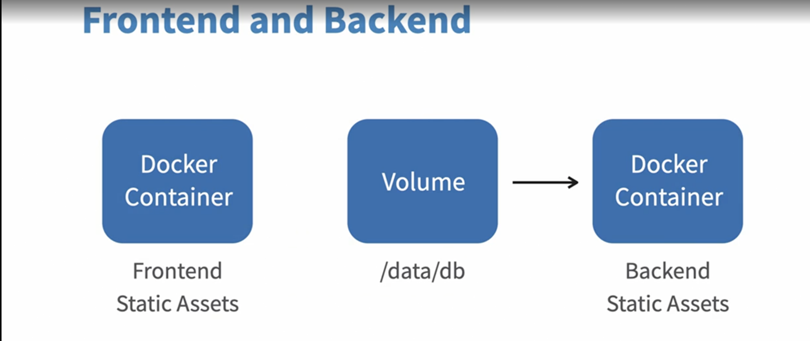
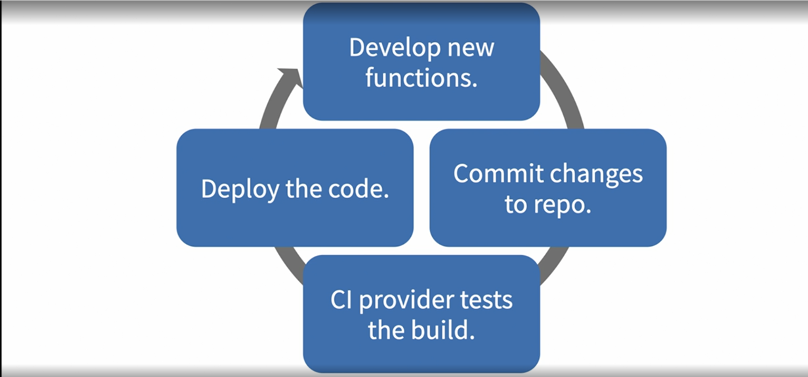

# Docker for Developers
## Getting Start
### Docker concepts and use cases for developers
- Setting up a new project
- Same setup across different systems
- Same setup across different projectes or developers

**Container:** A container is basically where your application or a specific resource is located.

### Base commands exploration
```sh
docker build -t jvalsesia/simple-backend .
docker images | grep simple-backend
docker run -p 4000:4000 jvalsesia/simple-backend
docker ps
docker stop 4b1c
docker pull jvalsesia/simple-backend
```

## Developing with Docker
### Overview back-end/front-end architecture


### Pratical back end with Compose
docker-compose.yaml:
```yaml
version: "1"
services:
  app:
    container_name: app
    restart: always
    build: .
    ports:
      - "4000:4000"
    links:
      - mongo
    depends_on:
      - mongo
  mongo:
    container_name: mongo
    image: mongo
    volumes:
      - data:/data/db
    ports:
      - "27017:27017"
volumes:
  data:
```
### Finalize and test the back-end setup
```sh
docker-compose build
docker-compose up -d
docker ps
docker logs mongo
docker-compose stop
docker-compose start
```
The '-d mongo' tell to start mongo container first.

### Finalize and test the front-end setup
```sh
docker build -t jvalsesia/simple-frontend .
docker images | grep simple-frontend
docker run -p 3000:3000 jvalsesia/simple-frontend
docker ps
docker stop 8382
docker pull jvalsesia/simple-frontend
```

### Full stack setup: Put it all together
```sh
docker-compose build
docker-compose up -d
docker ps
docker logs api
docker logs client
docker logs mongo
docker-compose stop
docker-compose start
```

## Kubernetes
### Deploy your first app to the cluster
```sh
kubectl create deployment nodeapp2 --image=node:current
```

## CI and Deployment with Docker
### The CI and deployment use case for devs


### Continuous integration: Travis file
Create .travis.yml:
```yml
sudo: required
services:
  - docker

script:
  - docker build -t jvalsesia/node .
  - docker images jvalsesia/node

```

### Integration with GitHub
```sh
git remote add origin https://github.com/jvalsesia/test-node.git
```
